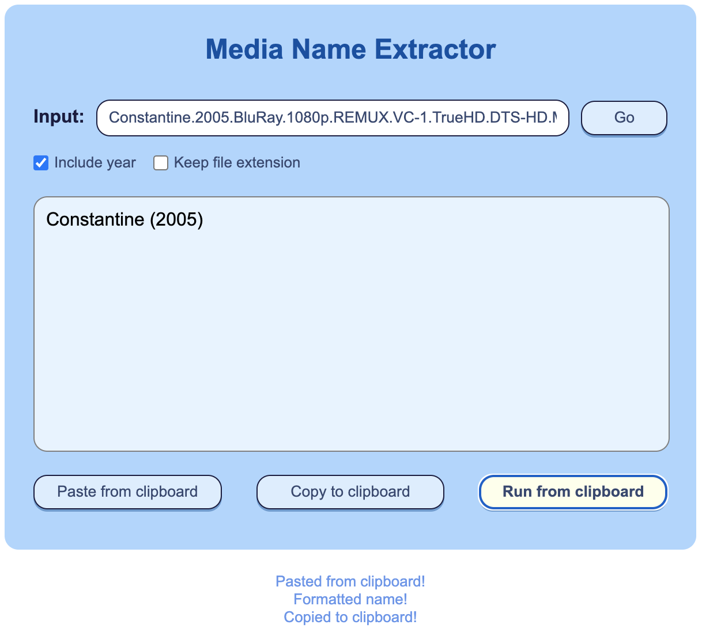

# Media name extractor

A web utility to rename video files into a more 'friendly' name. Useful when converting videos to multiple formats and for cataloguing media.

Simply set the input and press Go.

## Screenshot

  

## Example
> Constantine.2005.BluRay.1080p.REMUX.VC-1.TrueHD.DTS-HD.MA.5.1-LEGi0N.mkv

**Will rename to:**

> Constantine (2005)

## Installation

**Install dependencies:** `npm install`

**Bundle JS code:** `npm run build`

**Run the webapp:** Open the *index.html* file in the browser.

## Options

**Include year**:\
Includes release year (in brackets)

**Keep file extension**:\
Includes file extension, if present.\
*If a '.' is present it will assume an extension is present*

**Paste from clipboard**:\
Fills input field with text from clipboard.

**Copy to clipboard**:\
Copies output box content to clipboard.

**Run from clipboard**:\
Fills input field with text from clipboard and runs conversion. It also copies output to the clipboard.

## Credits
Credit goes to [Clément Escolano](https://github.com/clement-escolano)'s [parse-torrent-title](https://github.com/clement-escolano/parse-torrent-title) fantastic tool, developed in Javascript. Check him out.

## Disclaimer

I don't condone downloading nor sharing illegal content of any kind. This tool was developed to assist me in renaming my personal and legal video conversions. 
